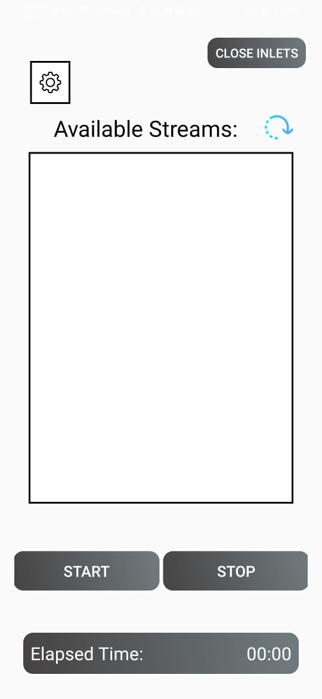
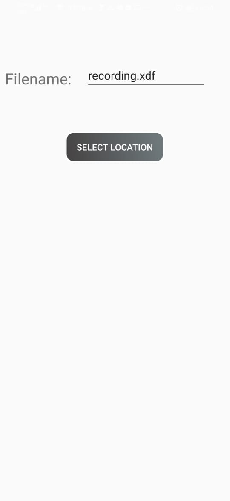
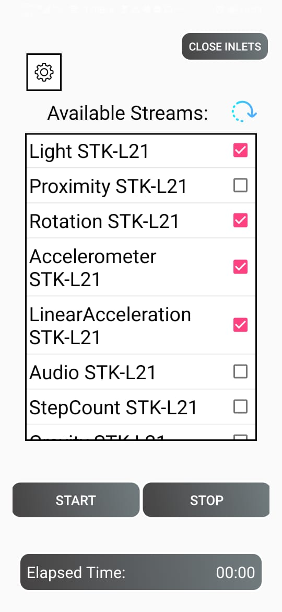
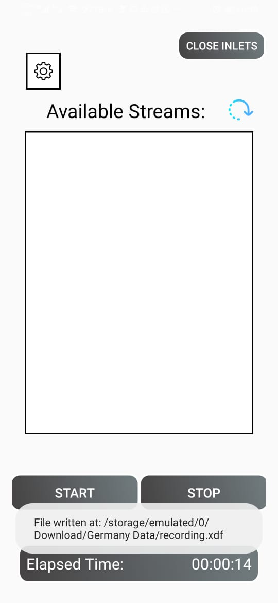

# LSL_RECORDER

LSL recorder is an android application to record real time LSL streams over the network. It's mainly tested with an Android LSL streams generating app which stream followin sensor readings: 

- Accelerometer
- Light
- Proximity
- Gravity
- Linear Acceleration
- Rotation Vector
- Step Count

Using LSL Recorder you can record any kind of LSL streams over the network. It support recording of following types of stream data: 

- Byte
- Short
- Int
- Float
- Double
- String

## Getting Started
#### Development:

In order to start with development you need to follow these steps: 

- Clone this repository
- Open project with Android Studio

If you get errors in build related to native, built in functions such as fgetpos and fsetpos in cstdio, this problem arises beacuse of the version of the ndk that you are using. Follow this link https://developer.android.com/ndk/downloads/older_releases.html to download Revision 14b. Now to update the ndk in android studio go to File -> Project Structure -> SDK Location -> Android NDK location and set the path to point at android-ndk-r14b.

#### Usage: 

Install this application and start recording data by:

1. Choosing Filepath by clicking on Settings icon.
2. Click on refresh button to see available streams.
3. Select streams you want to record.
4. Click on Start button to start recording.
5. When you want to stop recording click on Stop to stop recording and wait for the file to be written. Once complete app will show toast with file location 




<br><br><br><br><br><br><br><br><br><br><br><br><br><br><br><br><br><br><br><br><br><br><br>

## XDF File Reading

Once data has been recorded, transfer the file to your computer and then you can read the recorded xdf file in Matlab. Get load_xdf function from this [repository](https://github.com/xdf-modules/xdf-Matlab/tree/87bf5117edfed420ec728c76f50bb71f3722b41c). You can directly use this load_xdf function to load xdf file recorded using the app. 

```
data = load_xdf("filename.xdf");
```
## Built With

* [Android Studio](https://developer.android.com/studio/) - Android development framework
* [LSL ](https://github.com/sccn/labstreaminglayer) - Lab Streaming Layer library

## Contributing

Please feel free to contribute to this project by creating an issue first and then sending a pull request against the issue. 

## Authors

* **Ali Ayub Khan** - [AliAyub007](https://github.com/AliAyub007)

## Acknowledgments

[liblsl Library](https://github.com/sccn/labstreaminglayer/tree/master/LSL): I used this library to develop this application. 
