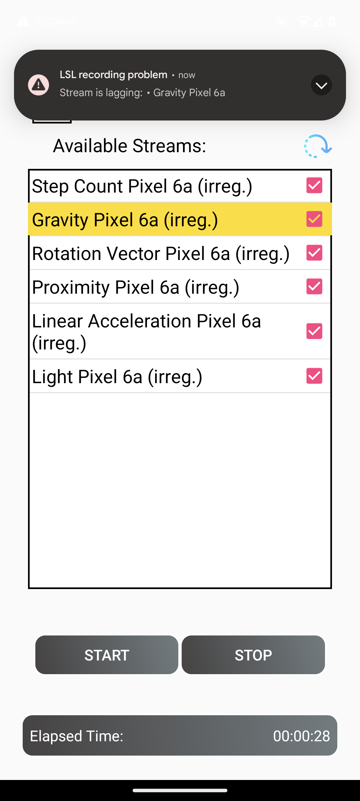

# RECORDA
## Overview

**RECORDA** is an Android application to record [LabStreamingLayer](https://labstreaminglayer.readthedocs.io/) (LSL) streams directly on a smartphone. 
Much like the [LabRecorder](https://github.com/labstreaminglayer/App-LabRecorder), **RECORDA** detects LSL streams on the network and records them in the standard file format for LSL streams (XDF, "Extensible Data Format").

In our lab, **RECORDA** is mainly used in combination with [SENDA](https://github.com/NeuropsyOL/SENDA), an Android app which streams data from all sensors that it finds on the phone. Typically, the built-in sensors include:

- Accelerometer
- Light
- Proximity
- Gravity
- Linear Acceleration
- Rotation Vector
- Step Count

For a complete list and full specifications on the sensor data, please check out the official [Android Sensor Documentary](https://developer.android.com/develop/sensors-and-location/sensors/sensors_overview). 

However, since **RECORDA** is using the LSL framework, it can record any kind of LSL stream, they can stem from seperate devices on the same network.

## Getting Started With the App
### Getting the APK file
Download the [latest release](https://github.com/NeuropsyOL/RECORDA/releases/latest) and install the apk on your smartphone or tablet running Android 8.0 or higher. 

### Recording Data: 
- Start the app 
- You can choose a name for your recording in the settings. If you do not specify a name, a unique name for every new file is used 
- Click the refresh button to see available streams on the network
- Select all streams you want to record
- Start the recording by clicking on the start button
- Once finished with your experiment, click on the Stop button and wait for the file to be written. Recorda will show a notification once the file is ready. This notification also shows the file location. 

## Quality Monitoring
During a recording, **RECORDA** monitors the quality of the selected streams. 
The quality can have three different states: good, laggy, or bad. Good streams are not highlighted in the UI with a specific color, whereas laggy streams will have a yellow background and bad streams will have a red background.
If a good stream changes to laggy or bad, a heads-up notification is shown to the user, even if **RECORDA** runs in the background.  

There are several checks that can lead to a change in quality:
- If the LSL method `pull_samples` returns an error, the quality of the respective stream is set to bad. **RECORDA** will continue to call `pull_samples`, and if new samples are successfully received, the quality will switch back to good. This behaviour is implemented for *regular*, as well as *irregular* streams.

Additionally, for streams with a nominal *regular* sampling rate, two checks are being performed:
- The duration in which we did not receive any samples (timeout value for laggy: 1.5 seconds, timeout value for bad: 7 seconds)
- A comparison of the nominal sampling rate with the actual detected sampling rate in a recent time window (of 10s by default). If a lower sampling rate is being detected, the stream is considered laggy (threshold default value 90%). This metric never causes the bad state.

The worse result of these two metrics will be displayed in the UI.

Importantly, streams being declared as having an *irregular nominal sampling rate* by the sending side, are not checked with the timeout or deviating sampling rate checks.

  

  

 
## XDF File Handling
Once data has been recorded, transfer the file to your computer and then open the file with a program of your choice. For Matlab, there are multiple XDF readers available, for example [this one](https://github.com/xdf-modules/xdf-Matlab). 

## Build RECORDA
We suggest to download and install the latest release of the app as described above. However, if you want to build the app yourself, you can also clone this repository
and then open the project with Android Studio.

#### Involved Tools
* Developed with Android Studio Giraffe (2022.3.1)
* Gradle >= 7.5
* JNA >= 5.12
* cmake >= 3.24.1 (install as SDK Tool in Android Studio)
* Android NDK >= 25 (install in Android Studio)

## Contributing
Please feel free to contribute to this project by creating an issue first and then sending a pull request against the issue. 

## Authors
The app is actively developed by the neuropsychology group of [Stefan Debener](https://uol.de/neuropsychologie) in Oldenburg, Germany.

#### Active Developers
* **Paul Maanen** - [pmaanen](https://github.com/pmaanen)
* **Sarah Blum** - [s4rify](https://github.com/s4rify)
* **Sören Jeserich**

#### Initial Implementation 
**Ali Ayub Khan** - [AliAyub007](https://github.com/AliAyub007)

## Acknowledgments

[liblsl Library](https://github.com/sccn/labstreaminglayer/tree/master/LSL): I used this library to develop this application. 
