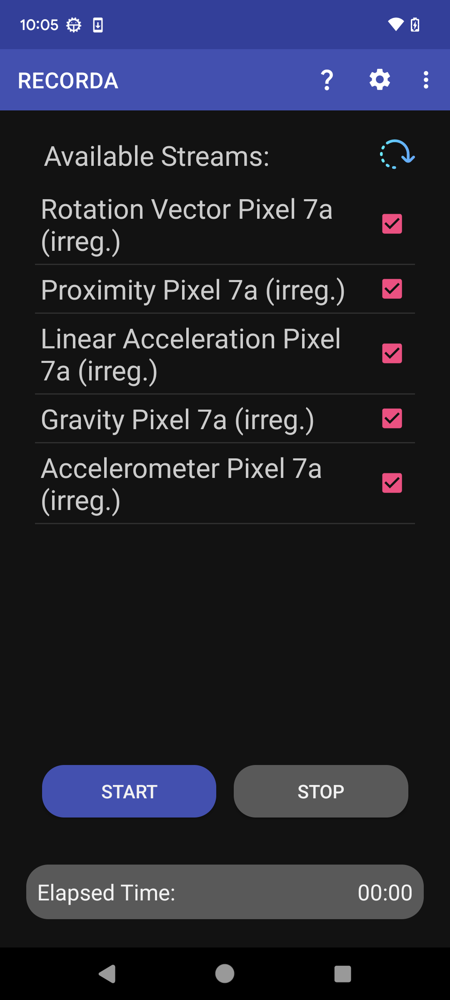

[](https://github.com/NeuropsyOL/RECORDA/actions/workflows/android_build.yml)
[](LICENSE.md)
[](https://github.com/NeuropsyOL/RECORDA/releases/latest)

# RECORDA — LabRecorder for Android

<div align="center">
  
</div>

> 📋 See [CHANGELOG.md](CHANGELOG.md) for the full version history.

---

## Citation

> **If you use RECORDA in your research, please cite the following publication:**
>
> Haupt et al. — *Title TBA upon publication* — accepted. Citation will be updated once a DOI is available.

RECORDA is provided **without any warranty**, and without guarantee of fitness for a particular purpose. Use it at your own risk. See [LICENSE](LICENSE) for the full terms.

---

**RECORDA** brings the power of [LabRecorder](https://github.com/labstreaminglayer/App-LabRecorder) to your pocket.  
It discovers [Lab Streaming Layer (LSL)](https://labstreaminglayer.readthedocs.io/) [[1]](#lsl-ref) streams on the local network and records them directly on an Android smartphone or tablet into the standard **XDF** file format — no laptop required.

---

## Table of Contents

1. [Citation](#citation)
2. [Why RECORDA?](#why-recorda)
3. [Features](#features)
4. [Getting Started](#getting-started)
5. [Recording Data](#recording-data)
6. [XDF Files & Importing Data](#xdf-files--importing-data)
7. [Quality Monitoring](#quality-monitoring)
8. [Dark Theme](#dark-theme)
9. [Building from Source](#building-from-source)
10. [Scientific Use Cases & Publications](#scientific-use-cases--publications)
11. [Contributing](#contributing)
12. [Authors](#authors)
13. [License](#license)
14. [Acknowledgments](#acknowledgments)

---

## Why RECORDA?

### LabRecorder — in your pocket
The [LabRecorder](https://github.com/labstreaminglayer/App-LabRecorder) is the standard tool in the LSL ecosystem for capturing multi-stream recordings, but it requires a desktop or laptop computer. **RECORDA** replicates that functionality entirely on Android, removing the need for any additional hardware in the loop.

### A key missing piece for mobile neuroscience
Smartphone-based research pipelines (mobile EEG, peripheral biosignals, motion capture) have gained enormous traction, but recording a synchronized multi-stream XDF file from a handheld device was not previously achievable. RECORDA closes that gap.

### liblsl compiled for Android — for the first time
RECORDA ships **liblsl compiled natively for Android** (ARMv7, ARM64, x86_64) using CMake and the Android NDK. The upstream liblsl project does not officially support Android, and a reliable Android build had not been publicly demonstrated before this project. We provide the full CMake toolchain setup in this repository so others can build on it.

### Designed for use with SENDA
RECORDA pairs seamlessly with [SENDA](https://github.com/NeuropsyOL/SENDA), our companion app that streams all built-in phone sensors (accelerometer, gyroscope, light, proximity, step count, and more) as LSL streams. Together they form a complete, self-contained mobile data acquisition system.

---

## Features

- 📡 **Auto-discovery** of all LSL streams on the local network
- 🗂 **XDF recording** — the universal standard format for multi-stream, time-synchronized data
- 📊 **Stream quality monitoring** — real-time good / laggy / bad indicators with heads-up notifications
- 💾 **Configurable save location** — choose any folder via the built-in folder picker
- 🌙 **Dark theme** — follows the system-wide dark/light mode setting
- 📱 **Minimum Android 8.0** (API 26), tested up to Android 14 (API 34)

---

## Getting Started

Download the [latest release APK](https://github.com/NeuropsyOL/RECORDA/releases/latest) and sideload it onto your Android smartphone or tablet (Android 8.0 or higher).

> **Tip:** Make sure the recording device and all streaming devices are on the **same local network** (e.g. the same Wi-Fi access point). LSL uses multicast discovery, which does not work across separate network segments.

---

## Recording Data

1. Open RECORDA. The home screen shows all main UI elements.
2. Tap **Refresh** (top right) to scan the network for available LSL streams.
3. Select the streams you want to record from the list *(format: Stream Name — Sampling Rate)*.
4. Optionally open **Settings** (gear icon, top left) to:
   - Set a custom recording name (a unique name is auto-generated if none is given).
   - **Choose the destination folder** for recorded XDF files via a folder picker. The chosen location is remembered across app restarts.
5. Tap **Start** to begin recording.
6. Tap **Stop** when the experiment is complete and wait for the finalisation notification — this confirms the XDF file has been written and closed correctly.

---

## XDF Files & Importing Data

All recordings are saved in the **[XDF (Extensible Data Format)](https://github.com/sccn/xdf)** — the standard interchange format for LSL-based, time-synchronised multi-stream data. XDF files store all streams, their metadata, and LSL timestamps in a single file.

### Import into your analysis software

| Platform | Tool | Notes |
|---|---|---|
| MATLAB | [xdf-Matlab](https://github.com/xdf-modules/xdf-Matlab) | Standalone loader, no toolbox required |
| MATLAB / EEGLAB | [EEGLAB + xdfimport plugin](https://sccn.ucsd.edu/eeglab/) | Full EEG analysis pipeline |
| MATLAB / Fieldtrip | [Fieldtrip](https://www.fieldtriptoolbox.org/) | Built-in XDF support via `ft_preprocessing` |
| Python | [pyxdf](https://github.com/xdf-modules/pyxdf) | Lightweight, dependency-free loader |
| Python / MNE | [MNE-Python](https://mne.tools/) | Via `mne.io.read_raw_xdf` (MNE ≥ 1.4) |
| BIDS | [EEG2BIDS / MNE-BIDS](https://mne.tools/mne-bids/) | Convert XDF recordings to BIDS format |

---

## Quality Monitoring

During a recording, RECORDA continuously monitors the health of each selected stream. States:

| State | UI indicator | Meaning |
|---|---|---|
| ✅ Good | No highlight | Stream is healthy |
| 🟡 Laggy | Yellow background | Possible packet loss or slow sender |
| 🔴 Bad | Red background | Stream has stalled or errored |

A **heads-up notification** is shown whenever a stream transitions to laggy or bad, even when the app is in the background.

**Checks performed** (for streams with a regular nominal sampling rate):
- `pull_samples` returns an error → **bad**
- No samples received for > 7 s → **bad** (> 1.5 s → **laggy**)
- Detected sampling rate < 90 % of nominal rate in a 10 s window → **laggy**

Streams declared as *irregular* by the sender are exempt from the timeout and rate-deviation checks.


---

## Dark Theme

RECORDA follows the system-wide dark/light mode. The dark colour scheme is visually aligned with the [SENDA](https://github.com/NeuropsyOL/SENDA) companion app for a consistent look across the two apps.

<div align="center">
  
</div>

---

## Building from Source

We recommend installing the pre-built release APK. If you need to build from source:

### Prerequisites

| Tool | Version |
|---|---|
| Android Studio | Giraffe \| 2022.3.1 Patch 2 |
| Android SDK Platform | API 34 |
| Android NDK | 25.2.9519653 |
| CMake | 3.22.1+ |

> Other versions may work but are untested.

### Steps

```bash
git clone --recurse-submodules https://github.com/NeuropsyOL/RECORDA.git
```

Then open the project in Android Studio and run **Build → Make Project**, or from the command line:

```bash
./gradlew assembleRelease
```

> **Note on liblsl:** The build compiles liblsl natively for Android via the `liblsl-Java` submodule using CMake and the NDK. No pre-built binaries are required — everything is built from source.

---

## Scientific Use Cases & Publications

RECORDA was developed to support mobile neuroscience and biosignal research.  
Below are studies from our lab that rely on (or motivated) the RECORDA / SENDA pipeline:

- **Blum S, Hölle D, Bleichner MG, Debener S.** Pocketable Labs for Everyone: Synchronized Multi-Sensor Data Streaming and Recording on Smartphones with the Lab Streaming Layer. *Sensors*, 2021; 21(23):8135. https://doi.org/10.3390/s21238135

- **Debener S, Minow F, Emkes R, Gandras K, de Vos M.** How about taking a low-cost, small, and wireless EEG for a walk? *Psychophysiology*, 2012; 49(11):1449–1453. https://doi.org/10.1111/j.1469-8986.2012.01471.x

<!-- 
  TODO: Add further publications that have used RECORDA for data collection.
  Example template:
  - **Author(s).** Title. *Journal*, Year; Vol(Issue):Pages. https://doi.org/...
-->

### Lab Streaming Layer
<a name="lsl-ref"></a>
- **Kothe C, Shirazi SY, Stenner T, Medine D, Boulay C, Grivich MI, Artoni F, Mullen T, Delorme A, Makeig S.** The Lab Streaming Layer for Synchronized Multimodal Recording. *Imaging Neurosci (Camb).* 2025;3:IMAG.a.136. https://doi.org/10.1162/IMAG.a.136

---

## Contributing

Contributions are welcome! Please:
1. [Open an issue](https://github.com/NeuropsyOL/RECORDA/issues) describing the bug or feature request.
2. Fork the repository and create a branch from `master`.
3. Submit a pull request referencing the issue.

---

## Authors

Developed by the [Neuropsychology Lab of Stefan Debener](https://uol.de/neuropsychologie), University of Oldenburg, Germany.

**Active Developers**
- **Paul Maanen** — [pmaanen](https://github.com/pmaanen)
- **Sarah Blum** — [s4rify](https://github.com/s4rify)
- **Sören Jeserich**

**Initial Implementation**
- **Ali Ayub Khan** — [AliAyub007](https://github.com/AliAyub007)

---

## License

GNU General Public License v3.0 — see [LICENSE.md](LICENSE.md) for details.

---

## Acknowledgments

- [liblsl](https://github.com/sccn/liblsl) — MIT License
- [liblsl-Java](https://github.com/labstreaminglayer/liblsl-Java) — MIT License
- [libxdf](https://github.com/labstreaminglayer/App-LabRecorder) — adapted from App-LabRecorder, MIT License


